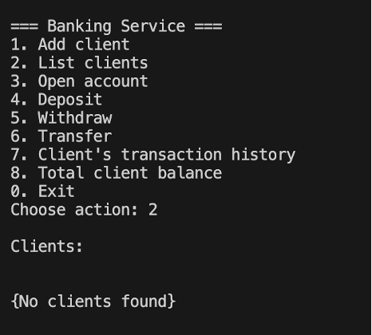
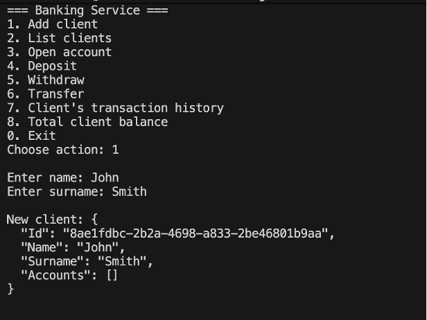
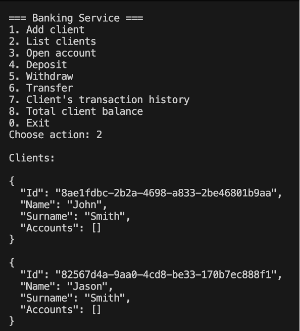
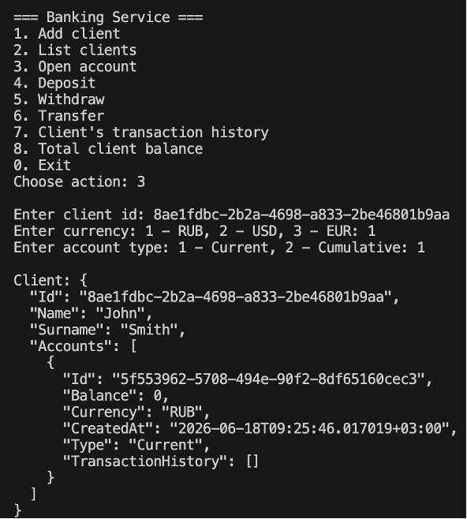
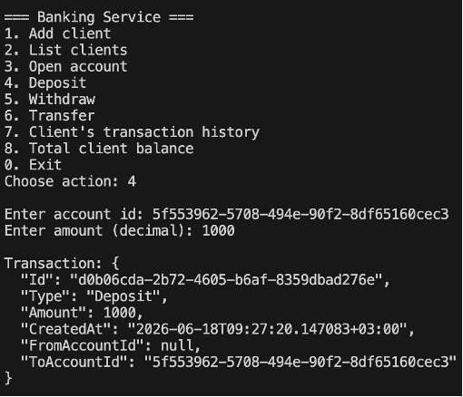
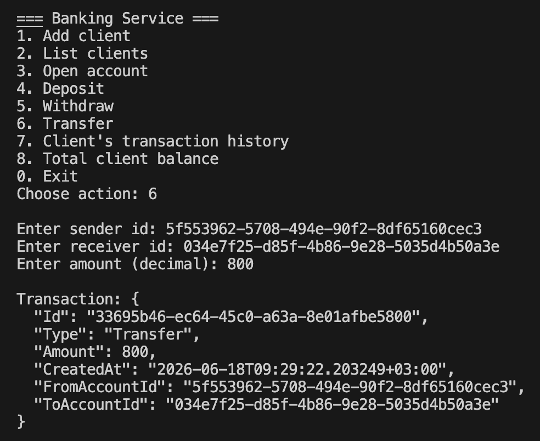
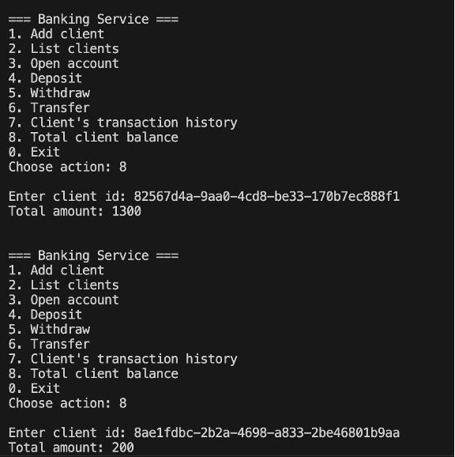

# Banking Service CLI

Консольное банковское приложение на C# и .NET.

## Функциональность

- **Управление клиентами**: добавление, обновление, удаление, поиск клиентов
- **Управление счетами**: открытие и закрытие счетов в RUB, USD и EUR
- **Транзакции**: пополнение, снятие и перевод средств между счетами с автоматической конвертацией валют
- **История транзакций**: просмотр всех транзакций клиента с фильтрацией по периоду
- **Общий баланс**: получение суммарного баланса клиента в рублях
- **Сохранение данных**: данные сохраняются в JSON файл и загружаются при запуске

## Технологии

- C# 14 / .NET 10
- `System.Text.Json` для сериализации
- xUnit для unit-тестов
- Многослойная архитектура (Models, Services, Storage)

## Структура проекта

```
BankingServiceCLI/
├── Models/          # Client, Account, Transaction, BankData
├── Services/        # Бизнес-логика (ClientService, AccountService)
│   └── Interfaces/  # IClientService, IAccountService
├── Exceptions/      # Кастомные исключения
├── Extensions/      # CurrencyExtensions (ToRub, FromRub)
├── Storage/         # JsonStorage
└── Program.cs       # Точка входа

BankingServiceCLI.Tests/
├── AccountServiceTests.cs
└── ClientServiceTests.cs
```

## Запуск

**Требования:** .NET 10 SDK

**Запустить приложение:**
```bash
cd BankingServiceCLI
dotnet run
```

**Запустить тесты:**
```bash
dotnet test
```

## Конвертация валют

Пополнение и снятие принимают суммы в рублях и автоматически конвертируют в валюту счёта:

| Валюта | Курс |
|--------|------|
| RUB | 1 |
| USD | 1 RUB = 1/80 USD |
| EUR | 1 RUB = 1/90 EUR |

## Архитектура

Проект следует многослойной архитектуре:

- **Models** — чистые модели данных, без бизнес-логики
- **Services** — бизнес-логика, зависит от интерфейсов
- **Storage** — хранение данных, независимо от сервисов
- **Program.cs** — точка сборки всех слоёв (Composition Root)

## Демонстрация

### Запуск


### Добавление клиента


### Вывод списка клиентов


### Открытие счёта


### Пополнение счёта


### Перевод между счетами


### Общий баланс клиента


## Пример сохранённых данных (storage.json)

```json
{
  "Clients": [
    {
      "Id": "8ae1fdbc-2b2a-4698-a833-2be46801b9aa",
      "Name": "John",
      "Surname": "Smith",
      "Accounts": [
        {
          "Id": "5f553962-5708-494e-90f2-8df65160cec3",
          "Balance": 200,
          "Currency": "RUB",
          "CreatedAt": "2026-06-18T09:25:46.017019+03:00",
          "Type": "Current",
          "TransactionHistory": [
            {
              "Id": "d0b06cda-2b72-4605-b6af-8359dbad276e",
              "Type": "Deposit",
              "Amount": 1000,
              "CreatedAt": "2026-06-18T09:27:20.147083+03:00",
              "FromAccountId": null,
              "ToAccountId": "5f553962-5708-494e-90f2-8df65160cec3"
            },
            {
              "Id": "33695b46-ec64-45c0-a63a-8e01afbe5800",
              "Type": "Transfer",
              "Amount": 800,
              "CreatedAt": "2026-06-18T09:29:22.203249+03:00",
              "FromAccountId": "5f553962-5708-494e-90f2-8df65160cec3",
              "ToAccountId": "034e7f25-d85f-4b86-9e28-5035d4b50a3e"
            }
          ]
        }
      ]
    },
    {
      "Id": "82567d4a-9aa0-4cd8-be33-170b7ec888f1",
      "Name": "Jason",
      "Surname": "Smith",
      "Accounts": [
        {
          "Id": "034e7f25-d85f-4b86-9e28-5035d4b50a3e",
          "Balance": 1300,
          "Currency": "RUB",
          "CreatedAt": "2026-06-18T09:26:44.404474+03:00",
          "Type": "Current",
          "TransactionHistory": [
            {
              "Id": "272cede3-c02a-478b-8da2-f55ca348fd9e",
              "Type": "Deposit",
              "Amount": 500,
              "CreatedAt": "2026-06-18T09:27:49.989588+03:00",
              "FromAccountId": null,
              "ToAccountId": "034e7f25-d85f-4b86-9e28-5035d4b50a3e"
            },
            {
              "Id": "33695b46-ec64-45c0-a63a-8e01afbe5800",
              "Type": "Transfer",
              "Amount": 800,
              "CreatedAt": "2026-06-18T09:29:22.203249+03:00",
              "FromAccountId": "5f553962-5708-494e-90f2-8df65160cec3",
              "ToAccountId": "034e7f25-d85f-4b86-9e28-5035d4b50a3e"
            }
          ]
        }
      ]
    }
  ]
}
